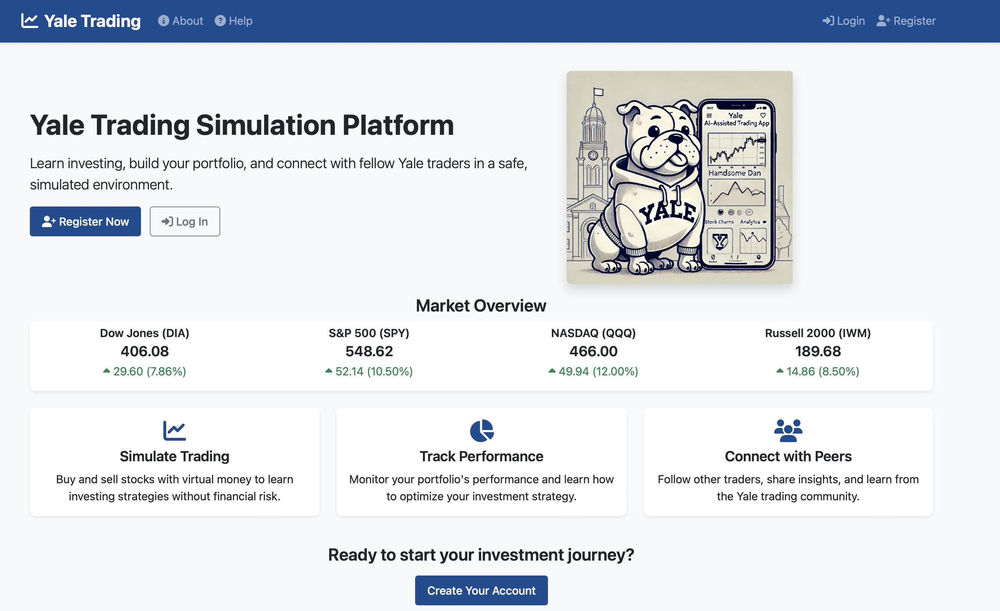

# Yale Trading Simulation Platform (YTSP) 

A Robinhood-like full-stack web application for Yale students to simulate stock investments, manage financial portfolios, and interact with a community of peers.

--- 



## Project Status

**Current Version: Beta Version**

This is the beta version of the platform with core trading functionality. The application is fully functional with user authentication, trading capabilities, portfolio management, and augmented social features.

### Roadmap

* **March 28 2024**: MVP Release with core trading, portfolio management, and social features ✅
* **April 9**: Alpha Version: Enhanced UI/UX and expanded community feature (like/dislike posts) ✅
* **April 18 2024**: Beta Version: Implement Yale CAS authentication, polish UI/UX with avator added, add enhanced interactive price trend chart over different time intervals ✅
* **May 3 2024**: Final Version:  Add AI-Assisted Trading Advice integration, finalize UI/UX design, comprehensive testing, documentation, and deployment

---

## Table of Contents
- [Features](#features)
- [Upcoming Features](#upcoming-features)
- [Tech Stack](#tech-stack)
- [Project Structure](#project-structure)
- [Setup Instructions](#setup-instructions)
- [User Guide](#user-guide)
- [Development Guidelines](#development-guidelines)
- [Testing](#testing)
- [Troubleshooting](#troubleshooting)
- [Contributing](#contributing)
- [License](#license)

---

## Features

### User Management
- **Authentication**: Secure registration and login system using Yale netid and Yale CAS
- **Profile Management**: Customize your trading profile and privacy settings
- **Fund Management**: Deposit and withdraw simulated funds with transaction history

### Trading Features
- **Stock Search**: Find companies by ticker symbol (e.g., AAPL, MSFT)
- **Real-time Data**: View current stock prices powered by Yahoo Finance API
- **Company Information**: Access detailed company profiles, financial statistics
- **Portfolio Management**:
  - Buy and sell stocks with (nearly) real-time pricing
  - Track your holdings with performance metrics
  - View historical trades and portfolio growth
  - Analyze investment distribution and sector exposure
  
### Social Features
- **User Network**: Follow other Yale students to build your investment network
- **Activity Feed**: View trading activities on the social feed platform or shared by the people you follow
- **Trading Posts**: Share insights about your trades with custom messages
- **Engagement**: Comment on trading posts, like or dislike posts
- **Interactive Reactions**: Like/dislike trading posts with visual feedback and counter updates
- **Privacy Control**: Set trading activities as public or private

---

## Upcoming Features

### Expanded social features
- **Leaderboards**: Compare performance with peers with more valuable metrics

### AI-Assisted Trading Advice
In then next iterations (Final release), we will integrate large language models (LLMs) to provide AI-assisted trading insights
- **Model**: Free tier of Gemini 2.5 flash 
- **AI-Assisted Trading**: AI evaluation of potential trades based on market conditions, historical data, and your portfolio composition
- **Risk Assessment**: Intelligent risk analysis for each transaction with personalized recommendations
- **Market Insights**: AI-generated explanations of market trends and events in plain language
- **Learning System**: Trading advice that improves over time based on your preferences and trading history
- **Strategy Recommendations**: Personalized investment strategies aligned with your goals and risk tolerance

This feature will leverage cutting-edge LLM reasoning models to provide contextual, personalized advice that helps users make more informed trading decisions while learning about investment principles.

---

## Tech Stack

### Backend
- **Framework**: Python Flask with Blueprints architecture
- **Database**: SQLite (ytsp.db in the instance directory for development) / PostgreSQL (production in future iterations)
- **ORM**: SQLAlchemy for database management
- **Authentication**: Flask-Login with secure password handling via Flask-Bcrypt
- **Forms**: WTForms with CSRF protection

### Frontend
- **Templates**: Jinja2 template engine
- **CSS Framework**: Bootstrap 5 for responsive design
- **JavaScript**: Vanilla JS with HTMX for dynamic content
- **Charts**: Chart.js for financial data visualization

### APIs & Services
- **Stock Data**: Integration with Yahoo Finance (yfinance)
- **Historical Data**: Time-series financial information
- **Company Information**: Company profiles and key statistics
- **AI Services**: Integration with LLM providers' APIs for trading advice (planned for future releases)

---

## Project Structure

```
ytsp/
├── app/                    # Main application package
│   ├── api/                # API endpoints
│   ├── controllers/        # Route handlers
│   │   ├── auth.py         # Authentication routes
│   │   ├── main.py         # Main site routes
│   │   ├── social.py       # Social feature routes
│   │   └── trading.py      # Trading functionality routes
│   ├── models/             # Database models
│   │   ├── user.py         # User model
│   │   ├── stock.py        # Stock and portfolio models
│   │   └── social.py       # Social interaction models
│   ├── static/             # Static assets (CSS, JS, images)
│   ├── templates/          # HTML templates
│   └── utils/              # Utility functions
├── migrations/             # Database migrations
├── tests/                  # Test suite
├── venv/                   # Virtual environment
├── .env                    # Environment variables
├── .env.example            # Example environment file
├── instance/               # Instance directory
│   └── ytsp.db             # SQLite database
├── requirements.txt        # Python dependencies
├── reset_seed_db.py        # Database reset and seeding utility
├── run.py                  # Application entry point
└── README.md               # This file
```

---

## Setup Instructions

### Prerequisites
- Python 3.8 or higher
- Git
- Internet connection for API access

### Installation

1. **Clone the repository**
```bash
git clone https://github.com/yale-cpsc-419-25sp/project-project-group-24
cd project-project-group-24
```

2. **Set up a virtual environment**
```bash
python -m venv venv
source venv/bin/activate  # On Windows: venv\Scripts\activate
```

3. **Install dependencies**
```bash
pip install -r requirements.txt
```

4. **Configure environment variables**
```bash
cp .env.example .env
# Edit .env with your configuration
```

5. **Initialize the database**
```bash
flask db init
flask db migrate -m "Initial migration"
flask db upgrade
```

6. **Populate with sample data (optional)**
```bash
# After database migrations have been applied
python reset_seed_db.py
```

7. **Run the application**
```bash
flask run
# or
python run.py
```

8. **Access the application at http://localhost:5000**

---

## User Guide

### Registration and Login
1. Navigate to the homepage
2. Click "Register" and complete the form with your Yale credentials
3. Log in with your credentials

### Managing Your Portfolio
1. After logging in, you'll be directed to your dashboard
2. To add funds: Go to "Account" → "Deposit Funds"
3. To buy stocks:
   - Use the search bar to find a stock by ticker symbol
   - Click on the stock to view details
   - Enter the quantity and click "Buy" (You can only buy whole shares)
4. To sell stocks:
   - Go to "Portfolio" → "Holdings"
   - Find the stock you want to sell
   - Enter the quantity and click "Sell"
5. To view performance:
   - Visit your portfolio dashboard for an overview
   - Click on individual holdings for detailed performance

### Social Features
1. To follow other users:
   - Search for users in the "Social" tab
   - Visit their profile and click "Follow"
2. To share a trade:
   - Complete a buy/sell transaction
   - Choose to make it public and add a comment
3. To engage with posts:
   - Browse the "Social Feed" to see posts from users you follow
   - Comment on posts
   - Like or dislike posts by clicking the thumbs up/down buttons
   - Click again on a liked/disliked post to remove your reaction

---

## Development Guidelines

### Database Migrations
When changing models:
```bash
flask db migrate -m "Description of changes"
flask db upgrade
```

### Adding New Features
1. Create/modify model classes in `app/models/`
2. Update controllers in `app/controllers/`
3. Create/modify templates in `app/templates/`
4. Add static assets in `app/static/`
5. Run tests to ensure functionality

---

## Testing

The MVP release has basic functionality testing implemented. Enhanced testing coverage will be added in alpha and beta releases.

---

## Troubleshooting

### Common Issues

#### API Connection Problems
If stock data isn't loading:
1. Check your internet connection
2. Verify that the Yahoo Finance API is accessible
3. Try searching for a popular ticker (AAPL, MSFT)
4. Check application logs for errors

#### Database Errors
If you encounter database issues:
1. Ensure migrations are up to date: `flask db upgrade`
2. If database is corrupted, reset it: `python reset_seed_db.py` (This will recreate ytsp.db in the instance directory)

#### Authentication Problems
If you can't log in:
1. Verify your credentials
2. We do not have a password reset functionality yet. If you forgot your password, please contact the developers or sign up for a new account.

---

## Contributing

1. Fork the repository
2. Create a feature branch: `git checkout -b feature-name`
3. Commit your changes: `git commit -m 'Add feature'`
4. Push to the branch: `git push origin feature-name`
5. Submit a pull request
   
---

## License

This project is licensed under the MIT License 

---

© 2024 Yale University CPSC 519 Project Team No. 24