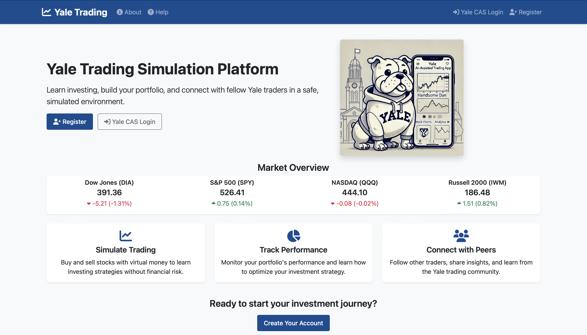
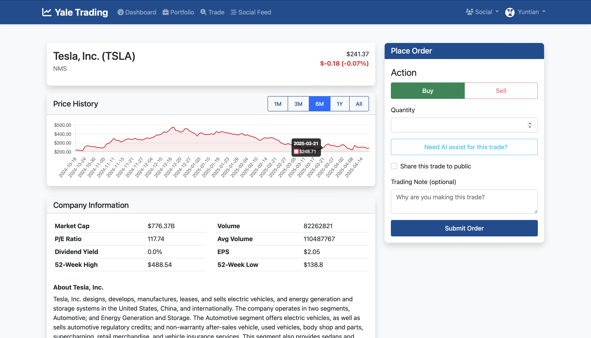
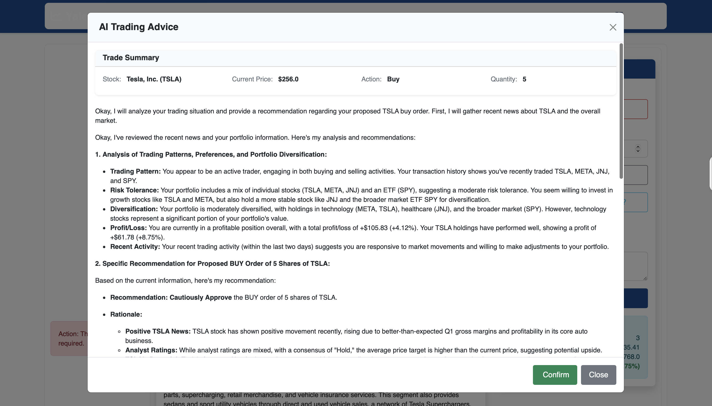
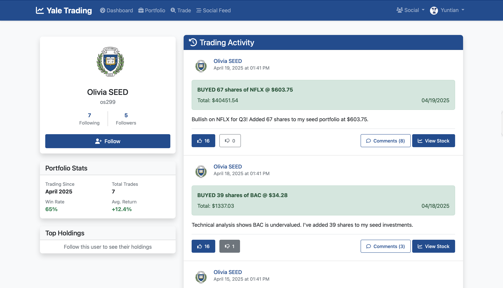

# Yale Trading Simulation Platform (YTSP) 

A full-stack web application for Yale students to simulate stock investments, manage financial portfolios, and interact with a community of peers.

--- 
<div align="center">
  <div style="display: flex; justify-content: space-between; margin-bottom: 20px;">
    <div style="width: 48%;">
      
      <p><strong>Yale Trading Platform - Main Page</strong></p>
    </div>
    <div style="width: 48%;">
      
      <p><strong>Yale Trading Platform - Stock Details</strong></p>
    </div>
  </div>
  
  <div style="display: flex; justify-content: space-between;">
    <div style="width: 48%;">
      
      <p><strong>Yale Trading Platform - AI Assist Trading</strong></p>
    </div>
    <div style="width: 48%;">
      
      <p><strong>Yale Trading Platform - Social</strong></p>
    </div>
  </div>
</div>

--- 

## Project Status

**Current Version: Final Version**

This is the final version of the platform with core trading functionality and AI-assisted features. The application is fully functional with user authentication, trading capabilities, portfolio management, augmented social features, and AI trading advice.

### Roadmap

* **March 28 2024**: MVP Release with core trading, portfolio management, and social features ✅
* **April 9**: Alpha Version: Enhanced UI/UX and expanded community feature (like/dislike posts) ✅
* **April 18 2024**: Beta Version: Implement Yale CAS authentication, polish UI/UX with avator added, add enhanced interactive price trend chart over different time intervals ✅
* **April 23 2024**: Beta Version II : Add AI-Assisted Trading Advice integration (structured prompt for gemini-2.0-flash grounding by real-time google search)✅
* **May 4 2024**: Final Version:  Finalize UI/UX design, comprehensive testing, documentation, and deployment ✅

---

## Table of Contents
- [Features](#features)
- [Tech Stack](#tech-stack)
- [Project Structure](#project-structure)
- [Setup Instructions](#setup-instructions)
- [User Guide](#user-guide)
- [Development Guidelines](#development-guidelines)
- [Testing](#testing)
- [Troubleshooting](#troubleshooting)
- [Contributing](#contributing)
- [Team](#team)
- [License](#license)

---

## Features

### User Management
- **Authentication**: Secure registration and login system using Yale netid and Yale CAS
- **Profile Management**: Customize your trading profile and privacy settings for your trading posts
- **Fund Management**: Deposit and withdraw simulated funds with transaction history

### Trading Features
- **Stock Search**: Find companies by ticker symbol (e.g., AAPL, MSFT)
- **Real-time Data**: View current stock prices powered by Yahoo Finance API
- **Historical Data**: View historical stock prices over different time intervals
- **Company Information**: Access detailed company profiles, financial statistics
- **Portfolio Management**:
  - Buy and sell stocks with (nearly) real-time pricing
  - Track your holdings with performance metrics
  - View historical trades and portfolio growth
  - Analyze investment distribution and sector exposure
  
### Social Features
- **User Network**: Follow other Yale students to build your investment network
- **Activity Feed**: View trading activities on the social feed platform or shared by the people you follow
- **Trading Posts**: Share insights about your trades with custom messages
- **Engagement**: Comment on trading posts, like or dislike posts
- **Interactive Reactions**: Like/dislike trading posts with visual feedback and counter updates
- **Privacy Control**: Set trading activities as public or private

### AI-Assisted Trading Advice
- **Personalized Analysis**: Get AI-generated advice tailored to your specific trading situation
- **Context-Aware Recommendations**: The system analyzes your:
  - Current holdings and portfolio composition
  - Trading history and patterns
  - Stock's current performance metrics
  - Recent market trends and news
- **Interactive Workflow**:
  1. Click "Need AI assist for this trade?" when placing an order
  2. Generate and review the prompt for your AI assistant (customizable)
  3. Confirm to send the prompt to your AI assistant 
  4. Review detailed AI trading advice response with markdown formatting
  5. View source references used by the AI for its analysis
  6. Choose to confirm and display the advice on your trading submission page
- **Grounded Analysis**: Model (Gemini-2.0-Flash) uses Google Search in real-time to provide up-to-date information about:
  - Recent stock news and developments
  - Market conditions and trends
  - Company-specific information
- **Comprehensive Advice**: Receive structured guidance including:
  - Analysis of your trading patterns and preferences
  - Specific recommendations for your proposed trade
  - Alternative trading strategies to consider
  - Potential risks and opportunities

---

## Tech Stack

### Backend
- **Framework**: Python Flask with Blueprints architecture
- **Database**: SQLite (ytsp.db in the instance directory for development)
- **ORM**: SQLAlchemy for database management
- **Authentication**: Flask-Login with secure password handling via Flask-Bcrypt and Yale CAS
- **Forms**: WTForms with CSRF protection
- **AI Integration**: Google Generative AI (Gemini) with search grounding capabilities

### Frontend
- **Templates**: Jinja2 template engine
- **CSS Framework**: Bootstrap 5 for responsive design
- **JavaScript**: Vanilla JS with HTMX for dynamic content
- **Charts**: Chart.js for financial data visualization
- **Markdown Rendering**: Marked.js for formatting AI responses

### APIs & Services
- **Stock Data**: Integration with nearly-real-time Yahoo Finance API
- **Historical Data**: Time-series financial information
- **Company Information**: Company profiles and key statistics
- **AI Services**: Google Gemini 2.0 Flash API with Google Search grounding

---

## Project Structure

```
ytsp/
├── app/                    # Main application package
│   ├── api/                # API endpoints
│   │   ├── stock_api.py    # Stock data endpoints
│   │   ├── user_api.py     # User data endpoints
│   │   └── ai_api.py       # AI assistance endpoints
│   ├── controllers/        # Route handlers
│   │   ├── auth.py         # Authentication routes
│   │   ├── main.py         # Main site routes
│   │   ├── social.py       # Social feature routes
│   │   └── trading.py      # Trading functionality routes
│   ├── models/             # Database models
│   │   ├── user.py         # User model
│   │   ├── stock.py        # Stock and portfolio models
│   │   └── social.py       # Social interaction models
│   ├── static/             # Static assets (CSS, JS, images)
│   ├── templates/          # HTML templates
│   └── utils/              # Utility functions
├── migrations/             # Database migrations
├── tests/                  # Test suite
├── venv/                   # Virtual environment
├── .env                    # Environment variables (includes GEMINI_API_KEY)
├── .env.example            # Example environment file
├── instance/               # Instance directory
│   └── ytsp.db             # SQLite database
├── requirements.txt        # Python dependencies
├── reset_seed_db.py        # Database reset and seeding utility
├── run.py                  # Application entry point
└── README.md               # This file
```

--- 
## Render deployment

YSTP has been deployed on Render. You can access the application at https://ytsp.onrender.com . 
We use a basic paid plan for the server and the database is in the same environment. The server and database could be terminated from time to time based on the limit and inactivity. So loss of user data can be expected, and you might start from scratch and be the only app user when accessing the app from this link. We will try to keep the app running as long as possible and improve it by hosting the database separately in the future.


---

## LocalServer Setup Instructions

### Prerequisites
- Python 3.8 or higher
- Git
- Internet connection for API access
- Google Gemini API key (for AI-assisted trading features)

### Installation

1. **Clone the repository**
```bash
git clone https://github.com/yale-cpsc-419-25sp/project-project-group-24
cd project-project-group-24
```

2. **Set up a virtual environment**
```bash
python -m venv venv
source venv/bin/activate  # On Windows: venv\Scripts\activate
```

3. **Install dependencies**
```bash
pip install -r requirements.txt
```

4. **Configure environment variables**
- google gemini api key is required for AI-assisted features
- To get the key, please visit https://aistudio.google.com/app/apikey
- Note the rate limit for the free tier gemini-2.0-flash API call
  - RPM (requests per minute) is 15
  - TPM (tokens per minute) is 1,000,000
  - RPD (requests per day) is 1,500
```bash
cp .env.example .env
# Edit .env with your configuration
# Be sure to include your GEMINI_API_KEY for AI-assisted features
```

5. **Initialize the database**
```bash
flask db init
flask db migrate -m "Initial migration"
flask db upgrade
```

6. **Populate with sample data (optional)**
```bash
# After database migrations have been applied
python reset_seed_db.py
```

7. **Run the application**
```bash
flask run
# or
python run.py
```

8. **Access the application at http://localhost:5000**

---

## Client User Guide

### Registration and Login
1. Navigate to the homepage
2. Click "Register" and complete the form with your Yale credentials
3. Log in with your credentials (you can not log in without registering first)

### Managing Your Portfolio
1. After logging in, you'll be directed to your dashboard
2. New users will be granted 1,000 virtual dollars to start with
3. To add funds: Go to "Account" → "Deposit Funds"
4. To buy stocks:
   - Use the search bar to find a stock by ticker symbol
   - Click on the stock to view details
   - Enter the quantity and click "Buy" (You can only trade whole shares)
5. To sell stocks:
   - Go to "Portfolio" → "Holdings"
   - Find the stock you want to sell
   - Enter the quantity and click "Sell"
6. To view performance:
   - Visit your portfolio dashboard for an overview
   - Click on individual holdings for detailed performance

### Using AI-Assisted Trading (Make sure you have made a trade first so that agent can have your trading history to generate the prompt)
1. Search for a stock and navigate to its detail page
2. Enter the quantity you wish to buy/sell
3. Click the "Need AI assist for this trade?" button
4. In the pop-up window, click "Generate and review your prompt first"
5. Review the generated prompt (which includes your portfolio data and trade details)
6. Edit the prompt if desired - it's fully customizable!
7. Click "Confirm my prompt for AI advice" like you send your prompt to your other AI friends (eg. chatgpt)
8. Review the AI's detailed analysis and recommendations in the new window
9. Click "Confirm" to add the AI advice to your trading page, or "Close" to dismissss it
10. If confirmed, the AI advice will appear on your stock detail page for reference
11. Submit your trade if you want to proceed with the trade

### Social Features
1. To follow other users:
   - Search for users by their netid in the "Social" tab
   - Visit their profile and click "Follow"
2. To share a trade:
   - Complete a buy/sell transaction
   - Choose add a comment to your trade and make it public
3. To engage with posts:
   - Browse the "Social Feed" to see posts from users you follow
   - Comment on posts
   - Like or dislike posts by clicking the thumbs up/down buttons
   - Click again on a liked/disliked post to remove your reaction

---

## Development Guidelines

### Database Migrations
When changing models:
```bash
flask db migrate -m "Description of changes"
flask db upgrade
```

### Adding New Features
1. Create/modify model classes in `app/models/`
2. Update controllers in `app/controllers/`
3. Create/modify templates in `app/templates/`
4. Add static assets in `app/static/`
5. Run tests to ensure functionality

---

## Testing

Comprehensive testing is currently under development. It is expected to be added in the final version.
---

## Troubleshooting

### Common Issues

#### API Connection Problems
If stock data isn't loading:
1. Check your internet connection
2. Verify that the Yahoo Finance API is accessible
3. Try searching for a popular ticker (AAPL, MSFT)
4. Check application logs for errors

#### AI Feature Issues
If the AI trading assistant isn't working:
1. Ensure your GEMINI_API_KEY is correctly set in your .env file
2. Check your internet connection as the AI uses Google Search for grounding
3. Check the current rate limit of free tier gemini-2.0-flash API and see if you have reached the limit
4. Try with a simpler prompt if context window size exceeds the model's limit
5. Check application logs for API errors

#### Database Errors
If you encounter database issues:
1. Ensure migrations are up to date: `flask db upgrade`
2. If database is corrupted, reset it: `python reset_seed_db.py` (This will recreate ytsp.db in the instance directory)

#### Authentication Problems
If you can't log in:
1. Make sure you are Yale affliated and have a valid netid. (This app is not open to the public yet)
2. Verify your credentials for Yale CAS

---

## Contributing

1. Fork the repository
2. Create a feature branch: `git checkout -b feature-name`
3. Commit your changes: `git commit -m 'Add feature'`
4. Push to the branch: `git push origin feature-name`
5. Submit a pull request
   
---

## Team

### Project Authors
- Yuntian Liu, PhD student in Biomedical informatics and data science department at Yale University
- Karen Dorantes, Undergrad Student in Computer Science at Yale University
- David Rodriguez, Undergrad Student in Computer Science at Yale University
- Zhiyuan Cao, PhD student in Biomedical informatics and data science department at Yale University

---

## License

This project is licensed under the MIT License 

---

© 2024 Yale University CPSC 519 Project Team No. 24. All rights reserved.